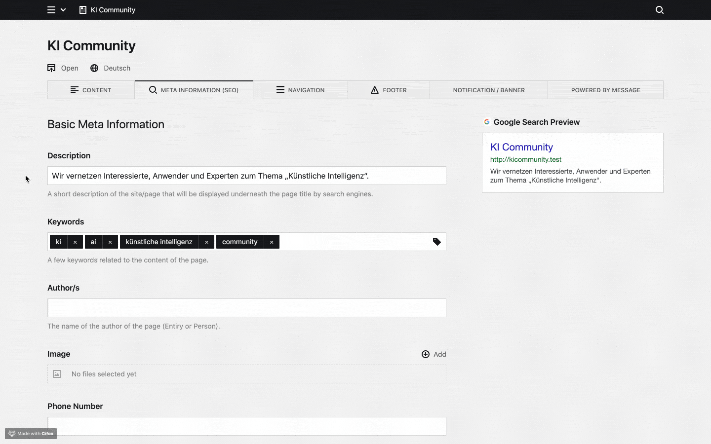

# Meta Knight – SEO for Kirby

Meta Knight is a SEO and Social Media Sharing Plugin for [Kirby](https://getkirby.com). Meta Knight makes it easier to work with meta information in Kirby's panel.

Meta Knight provides blueprints, snippets and custom preview sections. At the moment the plugin covers:

- Basic Meta Information (Title, Description, Keywords, Canonical URL, etc.) + Google Search Preview
- Open Graph + Facebook Sharing Preview
- Twitter Cards + Twitter Cards Preview
- Robots Settings

All of the above is neatly organized in a pre-composed SEO tab that can easily be added to any blueprint.



This plugin was originally developed at [diesdas.digital] by Jonathan Muth, Lorenz Seeger and Leslie Büttel. Meta Knight exists because we wanted to standardize the way we handle meta information across all our projects.

We'd also like to thank @distantnative for his help along the way! Without him this plugin wouldn't be what it is today.

## Config options

By default the *Page Title* will be rendered before the *Site Title* inside the title tag. Resulting in a title tag that looks like this `<title>Page Title – Site Title</title>`. If you want Site Title to come first, simply add the following to your Kirby `config.php` file.

```
'diesdasdigital.meta-knight' => [
    'siteTitleAfterPageTitle' => false,
],
```

---

## Installation

### Download

Download and copy this repository to `/site/plugins/kirby-meta-knight`.

### Git submodule

```bash
git submodule add https://github.com/diesdasdigital/kirby-meta-knight.git site/plugins/kirby-meta-knight
```

### Composer (not available yet)

```bash
composer require diesdasdigital/kirby-meta-knight
```

## Setup

How to add Meta Knight to Kirby:

1. Add this tab to your site's blueprint (site.yml): `seotab: seo` (Meta Knight uses the site's meta information as a fall back when no meta information is provided for a page)

2. Add this tab to all your page blueprints: `seotab: seo`

3. Add these two snippets to your head: `<?php snippet('meta_information'); ?>` + `<?php snippet('robots'); ?>`

Example:

```yaml
title: Site

tabs:
  content:
    icon: text
    label: Content
    sections:
      drafts:
        headline: Drafts
        type: pages
        status: draft
        templates:
          - default
          - masthead
        image:
          query: false
      unlisted:
        headline: Unlisted
        type: pages
        status: unlisted
        image:
          query: false
      listed:
        headline: Listed
        type: pages
        status: listed
        image:
          query: false

  seotab: seo
```

## Options

Currently the plugin isn't configurable via the `config.php` file. This is something we are thinking about adding in a future release.

## Development

### Development

You can start the dev process with …

```bash
yarn dev
```

This will automatically update the `index.js` and `index.css` of Meta Knight as soon as you make changes.
It will also enable hot module reloading in the panel. Reload the panel once and afterwards you should
see changes immediately without further reloading.

### Production

As soon as you are happy with the changed you've made to Meta Knight, you should build the final version with

```bash
yarn build
```

This will automatically create a minified and optimized version of your `index.js` and `index.css` that will improve load time in production environments.

## License

MIT – See LICENSE.md for more info.

## Credits

- [diesdas ⚡️ digital](https://github.com/diesdasdigital)
